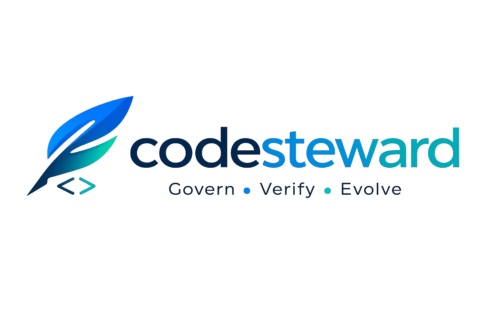

<p align="center">
  
</p>

<h1 align="center">Session Summarizer</h1>

<p align="center">
  Automatic LLM-powered summaries of AI-assisted development sessions.
  <br/>
  Part of the <strong>CodeSteward</strong> platform — Govern, Verify, Evolve.
</p>

<p align="center">
  
  
  
  <a href="LICENSE"></a>
</p>

<p align="center">
  <a href="#-quick-start">Quick Start</a> &bull;
  <a href="#-how-it-works">How It Works</a> &bull;
  <a href="#-configuration">Configuration</a>
</p>

---

A background service that reads raw audit events from ClickHouse (written by `codesteward-audit-proxy`), summarizes development sessions using an LLM, and writes structured summaries back to ClickHouse. Supports [Ollama](https://ollama.com) (local), OpenAI, and Anthropic as LLM providers.

Summaries are served by the `session_summaries` MCP tool in `codesteward-mcp`.

## 🔍 How it works

```text
  audit-proxy                                               codesteward-mcp
  writes events ──▶ ClickHouse ◀── reads summaries ──▶ MCP tool for IDEs
                        │
                        │ poll
                        ▼
               ┌─────────────────┐
               │   Summarizer    │
               │                 │
               │  1. Discover    │──▶ Find idle, unsummarized sessions
               │  2. Build       │──▶ Compress events into token-efficient context
               │  3. Summarize   │──▶ LLM produces summary, decisions, tags
               │  4. Write       │──▶ Structured results back to ClickHouse
               └─────────────────┘
```

**Short sessions** are summarized in a single LLM pass. **Long sessions** use a three-phase pipeline — extract structured facts from each chunk, merge deterministically, then synthesize the final summary — so no details are lost through double compression.

The summarizer is idempotent: re-running produces the same results. Bumping `SUMMARIZER_VERSION` triggers re-summarization of all sessions. Resumed sessions (with new events after a prior summary) are automatically detected and re-summarized. Each re-summarization creates a new revision, preserving prior summaries.

## ✨ Key features

|   | Feature | Description |
| - | ------- | ----------- |
| 🤖 | **Multi-provider LLM** | Ollama (local, default), OpenAI, and Anthropic via official SDKs |
| 🧩 | **Extract-merge-synthesize** | 11 structured fact categories extracted per chunk, merged losslessly, then synthesized |
| 📜 | **Revision history** | Re-summarization preserves all prior summaries and chunk extractions |
| 🔄 | **Resumed session detection** | Automatically re-summarizes sessions that received new events |
| 🌍 | **Language-aware budgets** | 28 languages with per-language chars-per-token ratios |
| ✂️ | **Smart chunking** | Prefers natural time gaps (>5 min) over arbitrary character splits |
| 🔒 | **Security by default** | Secrets stripped, `tool_input` bodies never sent to the LLM |
| ⏱️ | **Flexible scheduling** | Continuous polling (`poll`) or single-run for cron (`once`) |

## 🚀 Quick start

### Prerequisites

- Python 3.12+
- [uv](https://docs.astral.sh/uv/)
- ClickHouse accessible via HTTP
- An LLM provider: [Ollama](https://ollama.com) running locally, or an OpenAI/Anthropic API key

### Run with Ollama (default)

```bash
uv sync
uv run python -m summarizer.main
```

The summarizer will auto-pull the configured model on first start.

### Run with OpenAI

```bash
uv sync --extra openai
LLM_PROVIDER=openai SUMMARIZER_MODEL=gpt-4o-mini OPENAI_API_KEY=sk-... uv run python -m summarizer.main
```

### Run with Anthropic

```bash
uv sync --extra anthropic
LLM_PROVIDER=anthropic SUMMARIZER_MODEL=claude-haiku-4-5-20251001 ANTHROPIC_API_KEY=sk-ant-... uv run python -m summarizer.main
```

### Run with Docker Compose

```bash
docker compose up -d
```

This starts both the summarizer and an Ollama sidecar. The model is pulled automatically.

### Run once (cron mode)

```bash
RUN_MODE=once uv run python -m summarizer.main
```

Processes one batch of sessions and exits — ideal for scheduled jobs.

## ⚙️ Configuration

All configuration is via environment variables:

| Variable | Default | Description |
|----------|---------|-------------|
| `CLICKHOUSE_URL` | `http://localhost:8123` | ClickHouse HTTP interface |
| `CLICKHOUSE_USER` | `default` | ClickHouse user |
| `CLICKHOUSE_PASSWORD` | `""` | ClickHouse password |
| `CLICKHOUSE_DATABASE` | `audit` | Database name |
| `LLM_PROVIDER` | `ollama` | LLM provider: `ollama`, `openai`, or `anthropic` |
| `SUMMARIZER_MODEL` | `phi3:mini` | Model name (provider-specific) |
| `OLLAMA_URL` | `http://localhost:11434` | Ollama API endpoint |
| `OPENAI_API_KEY` | `""` | OpenAI API key (required when provider=openai) |
| `OPENAI_BASE_URL` | *unset* | Custom OpenAI-compatible endpoint |
| `ANTHROPIC_API_KEY` | `""` | Anthropic API key (required when provider=anthropic) |
| `RUN_MODE` | `poll` | `poll` (continuous) or `once` (single run, then exit) |
| `POLL_INTERVAL_SECONDS` | `300` | Seconds between polling cycles (poll mode only) |
| `SESSION_COOLDOWN_MINUTES` | `30` | Minutes of inactivity before summarizing |
| `LOOKBACK_HOURS` | `168` | How far back to look (default: 7 days) |
| `BATCH_SIZE` | `10` | Max sessions per cycle |
| `CONTEXT_MAX_TOKENS` | `4096` | Model's context window in tokens |
| `SESSION_LANGUAGE` | `en` | Session language for token budget calculation |
| `CONTEXT_MAX_CHARS` | (calculated) | Manual override — skips token calculation if set |
| `SUMMARIZER_VERSION` | `v1` | Bump to force re-summarization |
| `PROMPT_SOURCE` | `code` | `code` = hardcoded prompts, `database` = load from `prompt_registry` table |
| `EVALUATION_ENABLED` | `false` | When `true`, store full input contexts for downstream evaluation |
| `LOG_LEVEL` | `info` | Logging level |

The character budget for LLM prompts is calculated automatically from `CONTEXT_MAX_TOKENS` and `SESSION_LANGUAGE`. For example, a 32K-token Mistral model with German sessions (`CONTEXT_MAX_TOKENS=32768 SESSION_LANGUAGE=de`) gets a ~94K character budget. Set `CONTEXT_MAX_CHARS` to override the calculation.

## 🗄️ ClickHouse migrations

Migration files are [Goose](https://github.com/pressly/goose)-compatible and can also be applied manually.

### Option A: Using the migrations container (recommended)

Each release publishes a migrations container to GHCR. It uses [Goose](https://github.com/pressly/goose) to apply migrations with automatic version tracking:

```bash
docker run --rm --network host \
  -e GOOSE_DBSTRING="http://default:@localhost:8123/audit" \
  ghcr.io/codesteward/codesteward-session-summarizer-migrations:latest
```

> **Note:** Use `http://host:8123` for the HTTP protocol or `tcp://host:9000` for the native TCP protocol.

### Option B: Manual SQL

The migration files work as plain SQL — the goose annotations are comments that have no effect when run directly:

```bash
clickhouse-client --multiquery < migrations/001_session_summaries.sql
clickhouse-client --multiquery < migrations/002_session_chunk_extractions.sql
clickhouse-client --multiquery < migrations/003_prompt_registry.sql
clickhouse-client --multiquery < migrations/004_prompt_provenance.sql
clickhouse-client --multiquery < migrations/005_evaluation_contexts.sql
```

### Migration files

- `001_session_summaries.sql` — creates the `session_summaries` table with revision-based history
- `002_session_chunk_extractions.sql` — creates the `session_chunk_extractions` table for per-chunk fact extractions
- `003_prompt_registry.sql` — creates the `prompt_registry` table for database-driven prompt management
- `004_prompt_provenance.sql` — adds `prompt_id`, `prompt_hash`, `input_context_hash` columns to output tables
- `005_evaluation_contexts.sql` — creates TTL-managed tables for storing evaluation input contexts

## 🛠️ Development

```bash
# Install all dependencies (including dev + all provider SDKs)
uv sync --all-extras

# Run tests
uv run pytest

# Lint
uv run ruff check src/ tests/
uv run ruff format --check src/ tests/
```

## 📄 License

Apache-2.0. See [LICENSE](LICENSE) for details.
